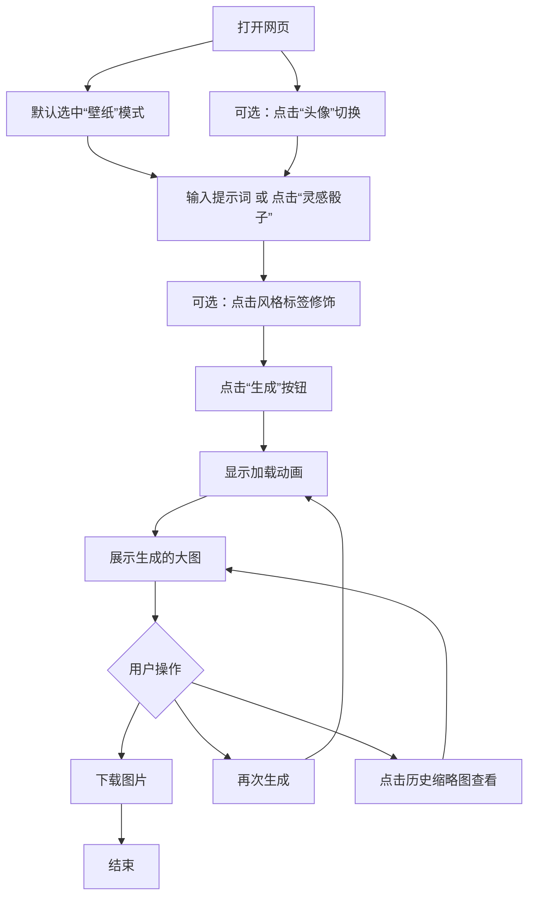

我来帮你把这个想法扩展成一份完整、简洁的PRD（产品需求文档）。这份文档聚焦于“简单易用”，去掉了复杂功能，只保留核心体验。

---

# 产品需求文档（PRD）：极简AI壁纸/头像生成器

**版本**：V1.0  
**目标上线时间**：MVP（最小可行产品）版本，2-4周开发周期  
**核心理念**：**“输入想法，立即得到一张可用于手机的精美图片”**。操作路径极短，零学习成本。

---

## 1. 产品目标与范围

### 1.1 产品目标
- **核心目标**：为用户提供一个**无需任何设计技能**，仅凭文字描述就能生成高质量手机壁纸和社交头像的工具。
- **用户体验目标**：从打开页面到生成第一张图片，总耗时不超过 **3步、30秒**。
- **商业目标（MVP阶段暂不考虑）**：验证用户需求，收集提示词数据，为后续个性化推荐做准备。

### 1.2 范围（明确不做什么）
- **不做**：社区、点赞、评论、关注等社交功能。
- **不做**：复杂的图片编辑（图层、滤镜、调色）。
- **不做**：多尺寸裁剪工具（我们自动生成标准尺寸）。
- **不做**：用户账号系统（无需登录即可使用，降低门槛）。

---

## 2. 用户角色与使用场景

### 2.1 核心用户画像
- **“灵感型用户”**：知道想要什么风格（如“赛博朋克”、“梦幻星空”），但不清楚具体画面，需要AI帮忙具象化。
- **“实用型用户”**：为了更换手机壁纸或社交头像而来，希望快速得到可用结果，不愿折腾。

### 2.2 关键使用场景
1.  **场景A（壁纸生成）**：用户输入“一座漂浮在云端的未来城市，霓虹灯，蓝色和紫色调”，点击生成，得到一张 **9:16** 比例的竖屏图片，直接设为壁纸。
2.  **场景B（头像生成）**：用户输入“一只戴着魔法帽的柴犬，卡通风格，明亮背景”，点击生成，得到一张 **1:1** 比例的正方形图片，用作头像。

---

## 3. 功能需求（核心功能清单）

我们遵循 **“极简三步走”** 设计：**选择类型 → 输入描述 → 一键生成与下载**。

### 功能模块一：类型选择（核心入口）
- **功能描述**：用户在生成前，首先明确图片用途。
- **交互方式**：两个醒目的大按钮/卡片切换。
  - 【生成壁纸】（默认选中）：目标比例 9:16（1080x1920 或适配主流手机）。
  - 【生成头像】：目标比例 1:1（1024x1024）。
- **视觉反馈**：选中状态有明显的高亮或缩放动效。

### 功能模块二：提示词输入框
- **功能描述**：用户用自然语言描述想要的画面。
- **交互细节**：
  - **占位符示例**：为降低输入门槛，显示滚动或随机示例，如：“一只在月球上钓鱼的猫”、“极光下的雪山”、“霓虹都市剪影”。
  - **输入框高度**：自适应2-3行，避免过长。
  - **字数限制**：建议不超过200字符（保证生成效率和效果）。
- **辅助功能**：提供 **“灵感骰子”** 按钮（随机填充一段示例提示词），帮助完全无想法的用户起步。

### 功能模块三：风格快捷标签（一键应用）
- **功能描述**：在输入框下方，提供 **5-6个** 最流行的风格滤镜标签，点击后自动追加到提示词末尾或替换当前描述。
- **标签示例**：
  - 🎨 油画风格
  - 🌟 3D卡通
  - 💧 水彩画
  - 🌌 赛博朋克
  - 📷 写实摄影
  - 🔮 梦幻唯美
- **交互逻辑**：点击标签，标签高亮，提示词框内文本更新。

### 功能模块四：生成与结果展示（核心流程）
- **功能描述**：点击【✨ 生成】按钮，调用AI绘图API，等待结果。
- **加载状态**：显示进度条或带有创意文案的加载动画（如“AI正在挥洒灵感...”），预计等待5-15秒。
- **结果展示**：
  - 生成后，图片以大图形式居中展示。
  - 图片下方提供两个核心操作按钮：
    1.  **【📥 下载图片】**：直接保存到用户设备相册。
    2.  **【🔄 再次生成】**：使用相同提示词重新生成一次（满足用户“想看看别的样子”的心理）。
- **历史记录（轻量级）**：在页面底部或侧边，以缩略图列表的形式展示**本次会话**中生成的所有图片（刷新页面即清空，保证隐私和简洁）。

---

## 4. 非功能需求（技术/设计约束）

### 4.1 性能要求
- 首屏加载时间 < 2秒。
- AI生成等待时间 < 15秒（需选择响应速度快的模型，如SDXL Turbo或Midjourney API）。
- 图片下载流畅，无卡顿。

### 4.2 设计风格（UI/UX）
- **视觉风格**：**“毛玻璃质感 + 极简主义”**。背景使用柔和的渐变色（如浅蓝到淡紫），营造科技感与梦幻感。
- **布局**：单列垂直布局，所有内容在首屏可见（或轻微滚动），操作区集中在中部。
- **字体**：使用大圆角、无衬线字体，确保清晰可读。
- **适配**：完美适配移动端（H5/响应式），同时兼顾PC端。

### 4.3 安全与合规
- **内容过滤**：集成NSFW（不适宜内容）过滤器，禁止生成暴力、色情、政治敏感内容。
- **版权**：在页面底部注明“图片由AI生成，仅供个人使用参考”。

---

## 5. 用户操作流程（核心路径）

---

## 6. 数据埋点（MVP仅需关注核心指标）

- **生成按钮点击次数**：衡量用户使用深度。
- **壁纸/头像生成比例**：了解用户偏好。
- **平均生成等待时长**：监控API性能。
- **下载按钮点击率**：衡量内容满意度（核心指标）。
- **“灵感骰子”使用次数**：衡量用户创作门槛高低。

---

## 7. 未来迭代方向（V2.0 备选）

- 增加“以图生图”功能（上传参考图）。
- 增加“批量生成”4格宫格图供选择。
- 简单的亮度/对比度微调滑块。
- 支持生成动态壁纸（Live Photo）格式。

---

这份PRD的核心是**克制**，只保留最必要、体验最顺畅的功能。你可以直接基于此文档与开发团队沟通或作为自己开发的蓝图。如果需要对某个功能模块（比如“风格标签”的具体实现或“内容过滤”策略）进行更深入的探讨，可以随时告诉我。